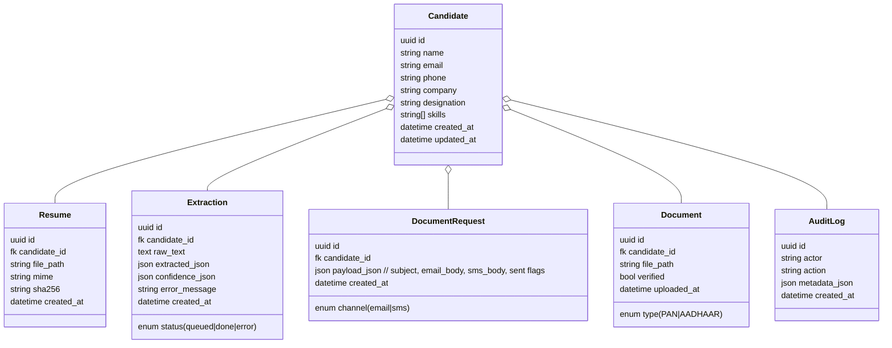

# TraqCheck – Resume Parsing & ID Collection (Take‑home)

A full‑stack system where HR uploads a resume, the backend extracts candidate details with confidence scores, and an AI agent generates (and can optionally **send**) a personalized request for PAN/Aadhaar via Email or SMS. Candidates’ identity files can be uploaded and viewed from the profile.

---

## ✍️ Challenge → Solution (at a glance)

**Challenge**

* Upload resume (PDF/DOCX)
* Extract: name, email, phone, company, designation, skills (+ confidences)
* AI agent crafts PAN/Aadhaar request; log it; optionally send via Email/SMS
* Upload PAN/Aadhaar images; list & track

**Solution**

* **Frontend**: React (Vite + TS, Tailwind). Drag‑and‑drop upload, dashboard, profile, request preview, document upload.
* **Backend**: Django + DRF, Celery worker, Postgres, Redis. Structured LLM calls. SMTP/Twilio adapters with safe dev‑mode logging.
* **Infra**: Docker Compose for local; easy lift to Render/Railway/Vercel.

---

## 🔒 Scope & Guardrails (v1/MVP)

* **In‑scope**

  * Text‑based PDFs/DOCX (no OCR for image‑only PDFs)
  * Deterministic regex extraction blended with LLM structured output
  * Confidence scores per field
  * PAN/Aadhaar request generation (logged; **send** works if keys configured; otherwise dev logs)
  * PAN/Aadhaar upload (image/PDF) with basic validation
  * Minimal audit logging (key actions)
* **Out‑of‑scope** (future)

  * OCR, fuzzy entity resolution, ML verification of documents
  * Advanced RBAC, SSO, multi‑tenant orgs, PII redaction pipelines

> In short: “HR uploads → we extract + preview → AI composes request → (optionally) send → receive docs.”

---

## ✅ Features

* [x] POST `/candidates/upload` (async parse via Celery)
* [x] GET `/candidates` (dashboard list with extraction status)
* [x] GET `/candidates/:id` (extracted + confidence + docs + requests)
* [x] POST `/candidates/:id/request-documents` (AI preview; **optional send_now** via Email/SMS)
* [x] POST `/candidates/:id/submit-documents` (PAN/Aadhaar upload)
* [x] Frontend Upload, Dashboard, Candidate Detail with request preview + upload

---

## 🧱 Tech Stack

* **Frontend**: React + TypeScript + Vite + TailwindCSS
* **Backend**: Django 5 + DRF, Celery, Redis, PostgreSQL
* **AI**: Provider‑agnostic client (OpenAI / OpenRouter / Anthropic)
* **Messaging**: SMTP (generic) and Twilio SMS (optional); dev mode logs to console
* **Runtime**: Docker Compose (local dev)

---

## 🗂️ Repository Structure

```
backend/
  api/
    __init__.py
    models.py
    serializers.py
    views.py              # endpoints inc. request-documents & submit-documents
    tasks.py              # parse_resume_task
    llm_client.py         # generate_structured(schema, system, user, ...)
    parsing.py            # (future: real parsing pipeline)
  core/
    __init__.py
    settings.py
    urls.py
    celery.py
    messenger.py          # send_email / send_sms (dev logs if no keys)
  manage.py
frontend/
  src/
    api/client.ts
    pages/Upload.tsx
    pages/Candidates.tsx
    pages/CandidateDetail.tsx
    routes.tsx, main.tsx, index.css
  index.html
.dockerignore
.docker-compose.yml
.env.example
README.md
volumes/
  docs/                   # stored resumes + identity uploads (git‑ignored)
```

---

## 🏗️ Architecture

```mermaid
flowchart LR
  A[Frontend (Vite/React)] -- upload resume --> B[(API /candidates/upload)]
  B -- create Candidate+Resume; Extraction=queued --> C[Celery Worker]
  C -->|parse_resume_task| D[(PostgreSQL)]
  A -- poll /candidates/:id --> B
  A -- request-documents (send_now?) --> B
  B -- generate preview w/ LLM --> D
  B -- optional send via SMTP/Twilio --> M[Messenger]
  A -- submit-documents (PAN/Aadhaar) --> B --> D
  A -- list candidates --> B --> D
```

**Flow (happy path)**

1. HR drops PDF/DOCX → `POST /candidates/upload` returns `{id, status:"parsing"}`
2. Celery parses & updates `Extraction` (status `done` or `error`)
3. UI polls `GET /candidates/:id` → shows extracted fields + confidences
4. HR clicks **Generate Request** (choose Auto/Email/SMS; optional **Send now**)
5. Backend logs request preview; if `send_now=true` and keys exist → send via SMTP/Twilio; otherwise dev logs
6. Candidate’s PAN/Aadhaar can be uploaded via `POST /candidates/:id/submit-documents`

---

## ⚙️ Environment Variables

Copy `.env.example` → `.env` and fill as needed.

**Core**

* `DATABASE_URL=postgres://postgres:postgres@db:5432/traqcheck`
* `REDIS_URL=redis://redis:6379/0`
* `ALLOWED_ORIGINS=http://localhost:5173`
* `SECRET_KEY=change-me-in-prod`
* `DOCS_DIR=/data/docs` (provided by compose volume)
* `ORG_NAME`, `ORG_SUPPORT_EMAIL`

**LLM (choose one)**

* `LLM_PROVIDER=openai|openrouter|anthropic`
* `OPENAI_API_KEY`, `OPENAI_MODEL`
* `OPENROUTER_API_KEY`, `OPENROUTER_MODEL`
* `ANTHROPIC_API_KEY`, `ANTHROPIC_MODEL`

**Email (one option)**

* `SMTP_HOST`, `SMTP_PORT`, `SMTP_USER`, `SMTP_PASS`, `FROM_EMAIL`

  * If unset → **dev mode**: messages logged to API console

**SMS (optional Twilio)**

* `TWILIO_ACCOUNT_SID`, `TWILIO_AUTH_TOKEN`, `TWILIO_FROM`

  * If unset → **dev mode**: SMS logged to API console

---

## ▶️ Local Development (Docker)

```bash
# clean restart (nukes DB + files under volumes/)
docker compose down -v

# build images you changed
docker compose build --no-cache api frontend

# bring up infrastructure first
docker compose up -d db redis
# wait for: "database system is ready to accept connections"
# (optional) probe
# docker compose exec db pg_isready -U postgres -h localhost

# start app tier
docker compose up -d api worker frontend

# sanity checks
curl -s http://localhost:8000/healthz     # -> {"status":"ok"}
open http://localhost:5173                # FE
```

**Common issues**

* **CORS mismatch**: ensure `VITE_API_BASE=http://localhost:8000` (frontend) and `ALLOWED_ORIGINS=http://localhost:5173` (API)
* **DB wait**: API shows “Waiting for db…” → ensure db is up (`pg_isready`), then `docker compose up -d --force-recreate api`
* **Vite/Rollup musl error**: we use `node:20-bullseye-slim` to avoid musl issues
* **Tailwind/PostCSS missing**: installed at build; rebuild `frontend` image if needed

---

## 🗃️ Data Model (ER)



---

## 🔌 API Reference

### Health

`GET /healthz` → `{status:"ok"}`

### Candidates

* `POST /candidates/upload` (multipart form: `resume` .pdf/.docx, ≤5MB) → `{id, status:"parsing"}`
* `GET /candidates` → list with `{id, name, email, company, extraction_status, updated_at}`
* `GET /candidates/:id` → `{extracted, confidence, documents[], requests[], extraction_status}`

### Requests (AI agent)

* `POST /candidates/:id/request-documents`

  * Body: `{ channel?: "email"|"sms", upload_url?, org_name?, support_email?, send_now?: boolean }`
  * Behavior:

    * If `channel` omitted → **Auto**: prefer high‑confidence email; else phone; else 400
    * Always logs preview JSON
    * If `send_now=true` **and** provider keys exist → sends via Email/SMS; sets `sent` flags in payload
  * Returns: `{ id, preview }`

### Documents

* `POST /candidates/:id/submit-documents` (multipart: `pan`, `aadhaar`)

  * Accepts: `.jpg/.jpeg/.png/.pdf` ≤8MB each
  * Returns: `{ saved: [{id,type,filename}] }`

**Sample curl**

```bash
# upload resume
curl -F "resume=@/path/to/file.pdf" http://localhost:8000/candidates/upload

# list
curl http://localhost:8000/candidates

# detail
curl http://localhost:8000/candidates/<id>

# generate + send now (auto channel)
curl -H "Content-Type: application/json" -d '{"send_now":true}' \
  http://localhost:8000/candidates/<id>/request-documents

# submit documents
curl -F pan=@/path/pan.pdf -F aadhaar=@/path/aadhaar.jpg \
  http://localhost:8000/candidates/<id>/submit-documents
```

---

## 🖥️ Frontend

* **Upload** page: drag‑and‑drop / click → POST upload → poll status → link to detail
* **Candidates** page: table with name/email/company/status
* **Candidate Detail**: profile fields, confidence bars, **Channel (Auto/Email/SMS)** + **Send now**, request preview, uploaded docs list, upload inputs

Config: `VITE_API_BASE` points to the API (see `.env.example`). Uses React Router for internal navigation.

---

## ✉️ Messaging (dev‑safe)

* Email via SMTP; SMS via Twilio. In dev (no keys) → **messages logged** to API console instead of sending
* See `backend/core/messenger.py` for the adapter layer

---

## 🧪 Testing (suggested)

* **Unit**: deterministic extractors, merge logic
* **Integration**: upload → queued extraction row; submit documents validation
* **E2E (optional)**: happy path using Playwright against local stack

---

## 🚀 Deployment (ideas)

* **Render/Railway**: one Docker service for Django (with Celery as worker dyno), one for Postgres, one for Redis
* **Vercel**: static build for frontend; point `VITE_API_BASE` at your API URL
* Set `ALLOWED_ORIGINS` to the deployed FE origin; rotate `SECRET_KEY`
* Use provider keys for real send

---

## 🔍 Troubleshooting

* **API says Waiting for db…** → ensure DB logs show *ready to accept connections*; bounce API
* **CORS blocked** → fix `ALLOWED_ORIGINS` (API) and `VITE_API_BASE` (FE)
* **Vite crashes with rollup musl** → using Debian slim image fixes it; rebuild `frontend`
* **Frontend cannot fetch** → confirm ports `8000` (API) and `5173` (FE) are listening and envs match

---

## 🗺️ Loom Walkthrough Script (≤5 min)

1. **Architecture** (30s): show README architecture diagram; call out Django/DRF + Celery + Postgres + Redis + React
2. **Upload** (60s): drag a resume, show candidate ID & polling → status becomes *done*
3. **Profile** (60s): open candidate detail, highlight extracted fields + confidence bars
4. **Agent** (60s): choose *Auto*, tick *Send now*, click *Generate Request* → show preview and API logs showing dev‑send
5. **Documents** (45s): upload PAN/Aadhaar, see them listed
6. **Wrap** (30s): mention guardrails, future work (OCR, verification, deployment)

---

## 🛣️ Roadmap

* Real text‑extraction pipeline (PDFMiner/pypdf/docx) + schema‑guided LLM
* OCR for image‑only PDFs
* Signed download URLs & viewer; doc verification heuristics
* Retry/backoff + delivery webhooks for Email/SMS
* Admin actions (verify, notes, statuses), auditing & analytics
* CI (pytest, mypy, eslint), seed data, containerized prod deploy

---

## 📄 License

MIT (or your preferred license).

---

> Questions or feedback? Open an issue or reach out via the support email configured in `.env`.
